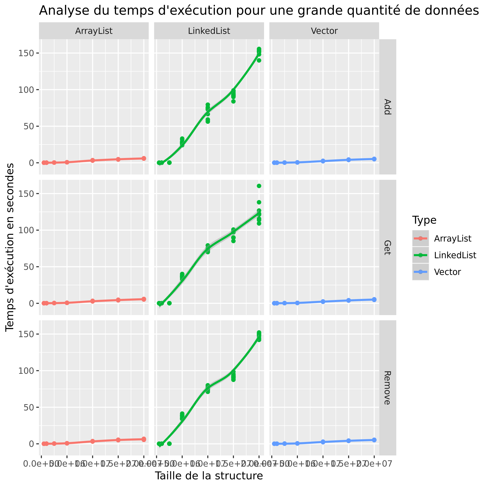

<div  align='center'>
    <h1> :man: BAUMANN Léo :man: </h1>
    <h1> :computer: P4a : Analyse de performances de différentes structures :computer: </h1>
    <p>[Grille d'évaluation P4a](https://docs.google.com/spreadsheets/d/1x72glVEQHPx56Wr8G0RNQgfQXGX6xCsjms_6b7J6si0/edit?usp=sharing)</p>
</div>

## Problème


Il existe différentes structures de données en informatique et ce peu importe le langage utilisé.
<br/>Etant donné que l'utilisation de ces structures influe grandement sur les performances d'un programme, il est nécessaire de se demander **laquelle est la plus performante à utliser** ?

Dans le but ainsi de répondre à cette question, nous allons étudier **le temps d'execution et la consommation de mémoire** de 3 des structures les plus utilisées en Java :
*  **ArrayList**
*  **LinkedList**
*  **Vector**

à travers l'application sur celles-ci de 3 méthodes : 
* **add(E element)** : L'ajout d'un élément
* **remove(int index)** : La suppression d'un élément
* **get(int index)** : L'accès à un élément

De plus, pour avoir des résultats précis et fiables, il sera nécessaire d'ajouter des **paramètres** aux calculs :
*  **La taille maximale des structures**
*  **Le nombre de test à réaliser sur celles-ci**

## Dispositif expérimental

### Application

[code source de l'application](./src/Main.java)
```
L'application analyse le temps d'exécution et la consommation de mémoire des méthodes add, remove et get sur les ArrayList, les LinkedList et les Vector en prenant comme paramètres leur taille et le nombre de tests à effectuer.
```

### Environnement de test

Description de la plateforme de test via le fichier /proc/cpuinfo
```
cpu family      : 6
model           : 158
model name      : Intel(R) Core(TM) i5-8300H CPU @ 2.30GHz
cpu MHz         : 2304.000
cache size      : 8192 KB
cpu cores       : 4

```

### Description de la démarche systématique

D'abord executer le shell script :
```
sh script.sh
```
*Grace à ce script shell, chaque méthode sera appliquée 10 fois sur les 3 différentes structures de données d'abord de taille 1000, ensuite 5000, 10000, 50000, 100000, 250000 et 500000.*
<br/>*En effet, ce script exécute le Main.java en lui donnant comme paramètres le type et la taille de structure à utiliser mais aussi la méthode à appliquer.*
<br/>*Le temps d'exécution, la consommation mémoire et les autres informations de ces structures seront ensuite écrit dans le fichier res.dat*

Ensuite executer le script R :
```
Rscript script.r
```
*Ce script R génerera 2 graphes au format png, en fonction des informations contenues dans le fichier res.dat, correspondants à l'analyse du temps d'exécution et de la consommation mémoire*

## Résultats préalables :chart_with_upwards_trend:

### Temps d'exécution


### Consommation mémoire


### Analyse des résultats préalables

**Analyse du temps d'exécution :**
* **ArrayList** : Peu importe la méthode appliquée sur celle-ci, d'après les graphes elle est la plus rapide.

* **LinkedList** : Elle est la structure la plus lente par rapport aux 2 autres.

* **Vector** : D'après sa courbe continue, elle est la plus fiable bien qu'elle soit moins rapide que l'ArrayList.

**Analyse de la consommation mémoire**
* **ArrayList** :  Structure correcte en terme de consommation mémoire.

* **LinkedList** : Cette structure est également la plus gourmande en mémoire.

* **Vector** : Structure la moins gourmande en mémoire peu importe la méthode appliquée.

### Discussion des résultats préalables

Peu importe sa taille, l'ArrayList semble être la structure de données la plus performante. En effet, elle trouve un juste milieu entre le temps d'exécution et la consommation mémoire.
<br/>En ce qui concerne la LinkedList, elle est assurément la moins performante, surtout en termes de consommation mémoire car chacun de ses nœuds est relié avec son élément et également avec l'adresse du nœud suivant et précédent.
<br/>Quant au Vector, on peut situer sa performance légèrement en dessous de celle de l'ArrayList, ce qui en fait une structure correcte du fait que sa taille évolue avec les besoins.

<br/>Ces tests ont pris comme taille maximale de structure 500000. On pourrait alors se demander si le Vector devient plus performant que l'ArrayList quand une plus grosse quantité de données, à savoir plusieurs millions, est en jeu.
## Etude approfondie

### Hypothèse

Jusqu'à une taille de 500000, la LinkedList semble être la moins rapide en termes de temps d'exécution et ce peu importe la méthode appliquée par rapport aux 2 autres structures de données.
<br/>Il est donc intéressant de se demander si cette dernière est toujours aussi lente lorsqu'une plus grosse quantité de données est en jeu.
### Protocole expérimental de vérification de l'hypothèse

Pour vérifier cette hypothèse, nous allons nettement augmenter la taille des structures dans le script shell : 500 000, 1 000 000, 2 500 000, 5 000 000, 10 000 000, 15 000 000 et 20 000 000.
Il sera ainsi nécessaire d'exécuter cet autre script : 
```
sh scriptHypo.sh
```
Pour l'établissement du graphe, il suffira juste d'exécuter ce script R :
```
Rscript scriptHypo.r
```


### Résultats expérimentaux :chart_with_upwards_trend:

#### Temps d'exécution




### Analyse des résultats expérimentaux

L'**ArrayList** et le **Vector** ont des temps d'exécution approximativement égaux voire égaux.
<br/>Cependant, on voit très nettement que les temps d'exécution de la **LinkedList** sont énormes. On constate ainsi une importante différence avec les 2 autres structures de données.

### Discussion des résultats expérimentaux

Cette hypothèse est ainsi **correcte**.
<br/>En effet, peu importe la taille, la LinkedList restera la plus lente par rapport à L'ArrayList et au Vector.
<br/>*Cependant, ce résultat ne concerne que les méthodes add, remove et get. Il est ainsi possible que la LinkedList puisse faire partie des plus rapides à l'exécution lors de l'application d'une autre méthode.*

## Conclusion et travaux futurs

Nous avons donc vu que l'ArrayList et le Vector sont très similaires en termes de performance **à contrario de la LinkedList**. 
<br/>En effet, cette dernière est bien plus lente que l'ArrayList et le Vector.
<br/>Il est ainsi évident de privilégier ces deux derniers dans un programme informatique si on veut que ce dernier soit performant.

Il pourrait être également intéressant d'**analyser les performances d'autres structures de données** comme le HashMap **avec d'autres méthodes** lors de futurs travaux.
<br/>Néanmoins pour l'instant, **je privilégierai désormais l'utilisation de l'ArrayList** lors de mes futurs projets informatiques.